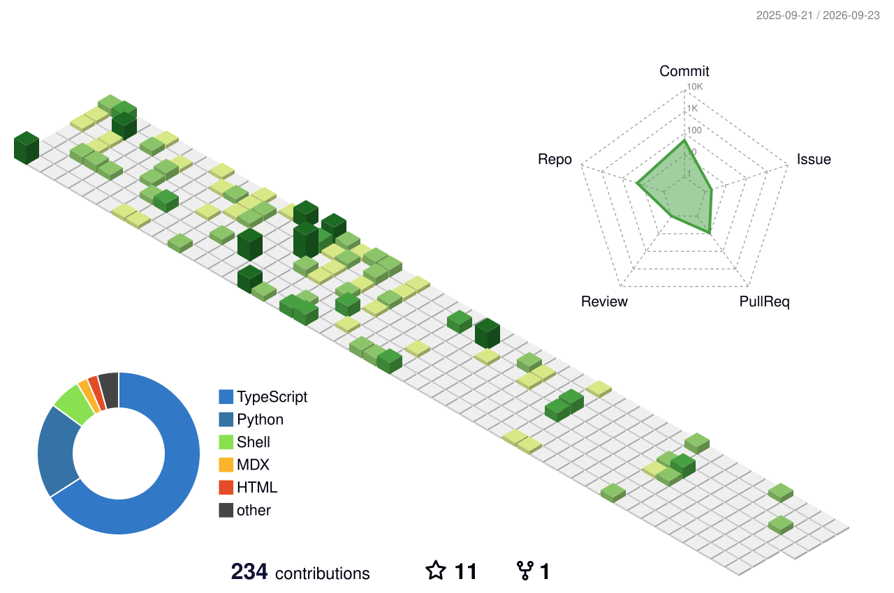

## Hi, I'm Yingbin Liu (liuyingbin1922)

### 🎓 Bio
- 🛒 Frontend Engineer at [Taobao](https://www.taobao.com) (Alibaba Group), based in Hangzhou
- 👀 Web Front-End · NestJS · AI Coding
- 📚 软考高级 · 信息系统项目管理师 (notes & journey below)

### 🚀 New
- 🤖 Introducing [claude-harness](https://github.com/liuyingbin1922/claude-harness), a self-driving development framework that lets Claude Code finish whole tasks in one go.
- 📒 Building [LearnHubFront](https://github.com/liuyingbin1922/LearnHubFront), a wrong-question notebook for web learners.

### 🔥 Something Hot
| Project | Stars | Forks | Introduction |
| :----: | :----: | :----: | :---- |
| [claude-harness](https://github.com/liuyingbin1922/claude-harness) |  |  | Self-driving framework for Claude Code to finish all tasks in one breath |
| [web-front-end-interview](https://github.com/liuyingbin1922/web-front-end-interview) |  |  | 前端面试八股问题汇总 |
| [Senior-manager-of-information-system-project](https://github.com/liuyingbin1922/Senior-manager-of-information-system-project) |  |  | 信息系统项目管理师（软考高级）备考笔记 |
| [my-book-about-Node.js](https://github.com/liuyingbin1922/my-book-about-Node.js) |  |  | Node.js 入门到云端部署 |
| [full-ecommence](https://github.com/liuyingbin1922/full-ecommence) |  |  | Vue3 + NestJS 一体化电商工程 |

### 💗 Something Awesome
| Project | Introduction |
| :----: | :---- |
| [web-front-end-interview](https://github.com/liuyingbin1922/web-front-end-interview) | 前端面试八股问题汇总 |
| [Senior-manager-of-information-system-project](https://github.com/liuyingbin1922/Senior-manager-of-information-system-project) | 软考高级 · 信息系统项目管理师备考笔记 |
| [solidity_note](https://github.com/liuyingbin1922/solidity_note) | Solidity 学习笔记 |
| [uniswap_notes](https://github.com/liuyingbin1922/uniswap_notes) | 对接 Uniswap 相关实践记录 |
| [learnEggjs](https://github.com/liuyingbin1922/learnEggjs) | 学习 Egg.js 的笔记 |

### 🤔 Something Interesting
| Project | Introduction |
| :----: | :---- |
| [claude-harness](https://github.com/liuyingbin1922/claude-harness) | 让 Claude Code 一口气完成所有任务的自驱动开发框架 |
| [LearnHubFront](https://github.com/liuyingbin1922/LearnHubFront) | 错题本前端 Web |
| [LearnGraphLab](https://github.com/liuyingbin1922/LearnGraphLab) | 错题讲解与知识点映射，支持视频讲解 |
| [aksskTools](https://github.com/liuyingbin1922/aksskTools) | AK/SK 工具集 |
| [ai-content](https://github.com/liuyingbin1922/ai-content) | AI 内容生成实践 |

### 🔧 Something Useful
| Project | Introduction |
| :----: | :---- |
| [wheel-using-ts](https://github.com/liuyingbin1922/wheel-using-ts) | 使用 TS 造轮子 |
| [mini-hmr](https://github.com/liuyingbin1922/mini-hmr) | 迷你 HMR 实现 |
| [chigajs](https://github.com/liuyingbin1922/chigajs) | A node framework based on koa |
| [email-extractor](https://github.com/liuyingbin1922/email-extractor) | Email 提取工具 |
| [this-whole-one](https://github.com/liuyingbin1922/this-whole-one) | 构建前端知识体系 |
| [all-in-one](https://github.com/liuyingbin1922/all-in-one) | All in one |

### 📑 Something paired with Certifications
- 🏆 [Senior-manager-of-information-system-project](https://github.com/liuyingbin1922/Senior-manager-of-information-system-project): 软考高级 · 信息系统项目管理师备考笔记
- 🥚 [my-book-about-Node.js](https://github.com/liuyingbin1922/my-book-about-Node.js): Node.js 入门到云端部署

### 🛏️ Living on the Github

